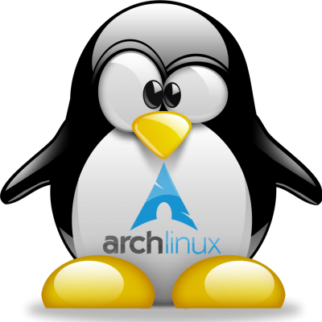
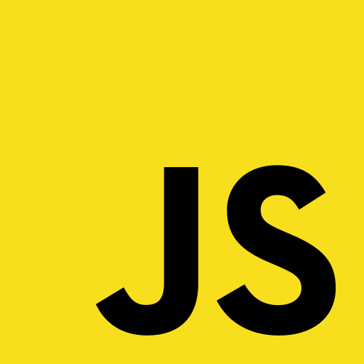

# Hi!

### I'm Zero!

I'm 14 years old and due to the pandemic I can spend,
almost all of my time on my laptop coding.

I've always been a huge tech enthusiast, even before I had a laptop I played
a lot with [Linux](https://github.com/UltiRequiem/dotfiles) in [Termux](https://github.com/termux/termux-app).

## Strengths

### Linux

My daily driver is [ArchLinux](https://archlinux.org/) with
[i3](https://github.com/UltiRequiem/dotfiles/blob/main/config/i3/config)
as my window manager, [Wezterm](https://github.com/wez/wezterm) as my terminal and
[Neovim](https://github.com/UltiRequiem/neovim) as my editor.

Before using Arch I also used distributions like Ubuntu or Debian,
even Geento but Arch is the one that best suited my needs.

---

### JavaScript

I started programming in JavaScript only two months ago,
but it has quickly become my favorite language because of things like asynchronism,
callbacks, and the fact that everything is an object.

Also the fact that I can use it almost anywhere seems very practical to me.

 
JavaScript Proyects

---

### Python

I started programming in Python at the end of December 2020,
I had already done some small scripts in Python before,
but December is where I really started studying.

Although it is no longer my favorite language,
I have a lot of affection for it since it was the first programming language I learned.

 
 Python Proyects

- 

  
Easy Proyects

- [IsEven.Py](https://github.com/UltiRequiem/isEven.py): Check is a integer is even or odd

 

- 

  
Intermediate Proyects

- [IsEven.Py](https://github.com/UltiRequiem/isEven.py): Check is a integer is even or odd

  

- 

  
Cool Proyects

- [IsEven.Py](https://github.com/UltiRequiem/isEven.py): Check is a integer is even or odd

  

---

### Others

I also like to program in [Ruby](https://github.com/UltiRequiem/daily-ruby-practice)
and [Golang](https://github.com/UltiRequiem/daily-go-practice),
although I don't have many serious projects using these languages.

### Socials

- [Reddit](https://www.reddit.com/u/UltiRequiem)

- [HackerRank](https://hackerrank.com/Ultirequiem)

- [Twitter](https://twitter.com/UltiRequiem)

- [Youtube](https://youtube.com/UltiRequiem)

- [StackOverflow](https://stackoverflow.com/users/14720975)

- [Stackexchange](https://stackexchange.com):

  - [Code Review](https://codereview.stackexchange.com/users/242958)

  - [Vi and Vim](https://vi.stackexchange.com/users/33268)

  - [Unix & Linux](https://unix.stackexchange.com/users/453042)

### Note

English is not my native language, so maybe I write a little weird,
I'm still learning it, although I can have fluent conversations as normal
and it's the default language for everything I use.
